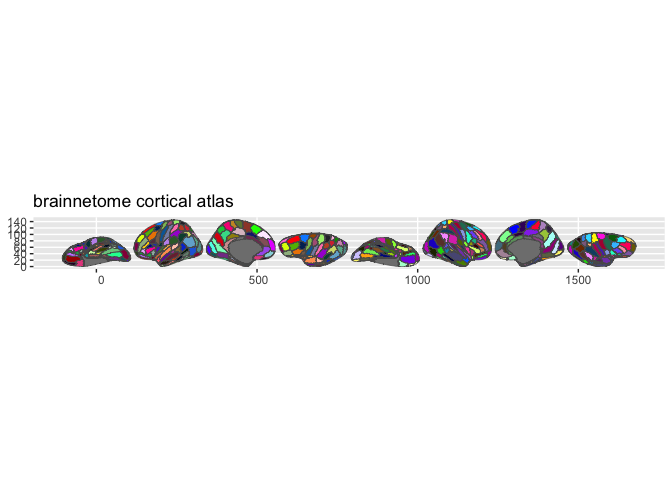

<!-- README.md is generated from README.Rmd. Please edit that file -->

# ggsegBrainnetome

<!-- badges: start -->

[](https://github.com/ggsegverse/ggsegBrainnetome/actions/workflows/R-CMD-check.yaml)
[](https://ggsegverse.r-universe.dev/ggsegBrainnetome)
<!-- badges: end -->

Brainnetome Atlas for the ggsegverse Ecosystem.

## Installation

``` r
# From r-universe
install.packages("ggsegBrainnetome", repos = "https://ggsegverse.r-universe.dev")

# From GitHub
# install.packages("remotes")
remotes::install_github("ggsegverse/ggsegBrainnetome")
```

## Atlases

### brainnetome

Cortical parcellation with 105 regions per hemisphere (Fan et al.,
2016).

``` r
library(ggsegBrainnetome)
plot(brainnetome())
```



### brainnetome_sub

Subcortical parcellation with 36 subregions.

``` r
plot(brainnetome_sub())
```


\## Data source

FreeSurfer fsaverage5 annotations + volumetric atlas from
[atlas.brainnetome.org](http://atlas.brainnetome.org/download.html).

- **Reference**: Fan et al. (2016)
  [doi:10.1093/cercor/bhw157](https://doi.org/10.1093/cercor/bhw157)
- **Date obtained**: 2021-10-14
