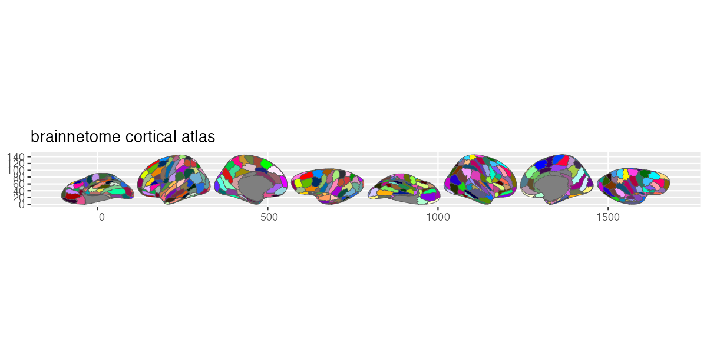
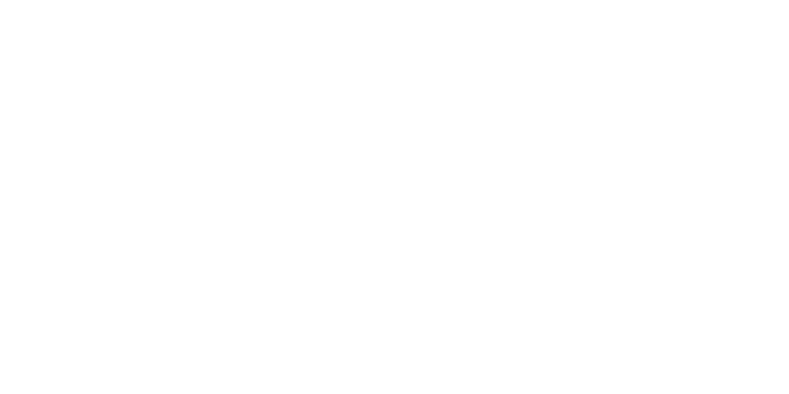

# ggsegBrainnetome

Brainnetome Atlas for the ggsegverse Ecosystem.

## Installation

``` r
# install.packages("remotes")
remotes::install_github("ggsegverse/ggsegBrainnetome")
```

## Usage

``` r
library(ggsegBrainnetome)
library(ggseg)

plot(brainnetome()) +
  theme_brain()
```

## Atlases

### brainnetome

Cortical parcellation with 105 regions per hemisphere based on connectional architecture (Fan et al., 2016).



### brainnetome\_sub

Subcortical parcellation with 36 subregions covering amygdala, hippocampus, thalamus, caudate, putamen, pallidum, and nucleus accumbens.


