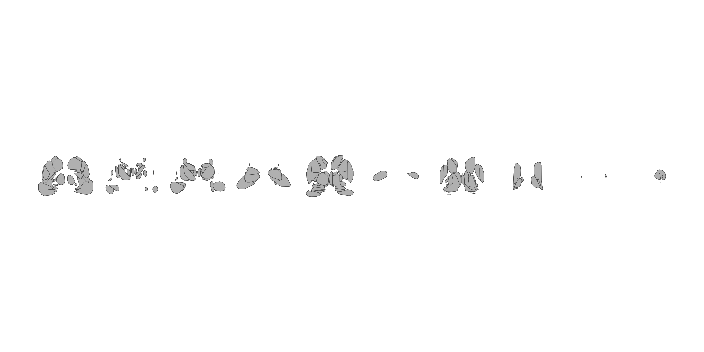

# ggsegBrainnetome

This package contains the [Brainnetome](https://atlas.brainnetome.org/)
atlas for plotting with ggseg.

Fan L, Li H, Zhuo J, Zhang Y, Wang J, Chen L, Yang Z, Chu C, Xie S,
Laird AR, Fox PT, Eickhoff SB, Yu C, Jiang T (2016). The Human
Brainnetome Atlas: A New Brain Atlas Based on Connectional Architecture.
*Cerebral Cortex*, 26(8):3508-3526.

## Installation

We recommend installing the ggseg-atlases through the ggseg
[r-universe](https://ggseg.r-universe.dev/ui#builds):

``` r
options(repos = c(
  ggseg = "https://ggseg.r-universe.dev",
  CRAN = "https://cloud.r-project.org"
))

install.packages("ggsegBrainnetome")
```

You can install this package from [GitHub](https://github.com/) with:

``` r
# install.packages("pak")
pak::pak("ggsegverse/ggsegBrainnetome")
```

## Cortical atlas

``` r
library(ggseg)
library(ggsegBrainnetome)
library(ggplot2)

ggplot() +
  geom_brain(
    atlas = brainnetome(),
    mapping = aes(fill = label),
    position = position_brain(hemi ~ view),
    show.legend = FALSE
  ) +
  scale_fill_manual(values = brainnetome()$palette, na.value = "grey") +
  theme_void()
```


## Subcortical atlas

``` r
ggplot() +
  geom_brain(
    atlas = brainnetome_sub(),
    mapping = aes(fill = label),
    show.legend = FALSE
  ) +
  scale_fill_manual(values = brainnetome_sub()$palette, na.value = "grey") +
  theme_void()
#> Warning: No shared levels found between `names(values)` of the manual scale and the
#> data's fill values.
#> No shared levels found between `names(values)` of the manual scale and the
#> data's fill values.
```



## Data source

Fan L, Li H, Zhuo J, Zhang Y, Wang J, Chen L, Yang Z, Chu C, Xie S,
Laird AR, Fox PT, Eickhoff SB, Yu C, Jiang T (2016). The Human
Brainnetome Atlas: A New Brain Atlas Based on Connectional Architecture.
*Cerebral Cortex*, 26(8):3508-3526.
[doi:10.1093/cercor/bhw157](https://doi.org/10.1093/cercor/bhw157)
